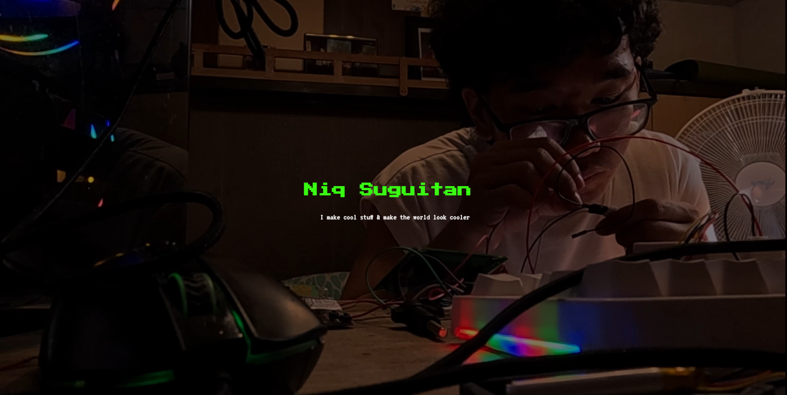

# Entry #0 - 08-21-25 - Revamping the Website

Alright so for this website, I wanted to do something else. I wanted to make a personal website for a small project, but I wanted it to be unique:

- A website that takes the lander on a film
- A website that takes you on a game 

Features:
- About me
- Home
- Photography
- Films
- Projects
- Blog 

And then, the hero section can have something like this:

Maybe the project section looks something like this?

